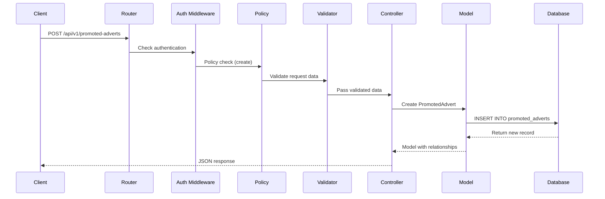
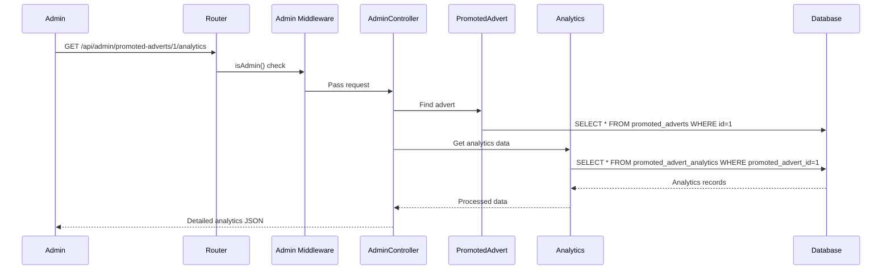

# 🔄 Backend Flow Documentation - Promoted Adverts System

## 📋 Table of Contents
1. [System Architecture Overview](#system-architecture-overview)
2. [Database Configuration](#database-configuration)
3. [Model Relationships](#model-relationships)
4. [API Request Flow](#api-request-flow)
5. [Admin Panel Integration](#admin-panel-integration)
6. [Authentication & Authorization](#authentication--authorization)
7. [Data Processing Flow](#data-processing-flow)
8. [File Upload Handling](#file-upload-handling)
9. [Analytics Tracking](#analytics-tracking)
10. [Error Handling & Validation](#error-handling--validation)

---

## 🏗️ System Architecture Overview

### **Layer Structure**
```
┌─────────────────────────────────────┐
│           Frontend Layer            │
│  (Blade Views + JavaScript)        │
├─────────────────────────────────────┤
│           API Layer                 │
│  (Controllers + Routes)             │
├─────────────────────────────────────┤
│          Business Logic             │
│  (Models + Policies + Services)    │
├─────────────────────────────────────┤
│         Data Access Layer          │
│  (Eloquent ORM + Database)         │
├─────────────────────────────────────┤
│         Database Layer              │
│  (MySQL + Migrations)              │
└─────────────────────────────────────┘
```

### **Key Components**
- **Database**: MySQL with no prefix (recently changed from `ea_`)
- **ORM**: Laravel Eloquent with relationships
- **API Controllers**: RESTful endpoints with validation
- **Admin Panel**: Filament with custom resources
- **Authentication**: JWT + Session-based
- **File Storage**: Laravel Storage system

---

## 🗄️ Database Configuration

### **Recent Changes**
✅ **Database Prefix**: Changed from `'ea_'` to `''` (empty string)
```php
// config/database.php
'mysql' => [
    // ... other config
    'prefix' => '', // Changed from 'ea_'
    'prefix_indexes' => true,
],
```

### **Table Structure**
```sql
-- Core Tables (No Prefix)
promoted_adverts
promoted_advert_categories  
promoted_advert_favorites
promoted_advert_analytics

-- User Table (Existing)
users (user_id as primary key)
```

### **Foreign Key Relationships**
```sql
-- promoted_adverts table
FOREIGN KEY (category_id) REFERENCES promoted_advert_categories(id)
FOREIGN KEY (user_id) REFERENCES users(user_id)

-- promoted_advert_favorites table  
FOREIGN KEY (promoted_advert_id) REFERENCES promoted_adverts(id)
FOREIGN KEY (user_id) REFERENCES users(user_id)

-- promoted_advert_analytics table
FOREIGN KEY (promoted_advert_id) REFERENCES promoted_adverts(id)
FOREIGN KEY (user_id) REFERENCES users(user_id)
```

---

## 🔗 Model Relationships

### **PromotedAdvert Model**
```php
class PromotedAdvert extends Model
{
    // Relationships
    public function category(): BelongsTo
    {
        return $this->belongsTo(PromotedAdvertCategory::class, 'category_id');
    }
    
    public function user(): BelongsTo
    {
        return $this->belongsTo(User::class, 'user_id');
    }
    
    public function favorites(): HasMany
    {
        return $this->hasMany(PromotedAdvertFavorite::class, 'promoted_advert_id');
    }
    
    public function analytics(): HasMany
    {
        return $this->hasMany(PromotedAdvertAnalytic::class, 'promoted_advert_id');
    }
}
```

### **User Model Extensions**
```php
class User extends Authenticatable
{
    // Promoted Adverts Relationships
    public function promotedAdverts()
    {
        return $this->hasMany(PromotedAdvert::class, 'user_id');
    }
    
    public function favoritePromotedAdverts()
    {
        return $this->belongsToMany(
            PromotedAdvert::class, 
            'promoted_advert_favorites', 
            'user_id', 
            'promoted_advert_id'
        )->withTimestamps();
    }
    
    // Admin Check
    public function isAdmin(): bool
    {
        return $this->role === 'admin' 
            || $this->is_admin === true 
            || $this->email === 'admin@worldwideadverts.com';
    }
}
```

---

## 🌐 API Request Flow

### **1. Public Endpoints Flow**
```
Client Request
    ↓
Route Definition (routes/api.php)
    ↓
Controller Method (PromotedAdvertController)
    ↓
Model Query (Eloquent)
    ↓
Database Response
    ↓
JSON Response to Client
```

### **2. Authenticated Endpoints Flow**
```
Client Request + JWT Token
    ↓
Authentication Middleware
    ↓
Authorization Check (Policy)
    ↓
Controller Method
    ↓
Business Logic
    ↓
Database Operations
    ↓
JSON Response
```

### **3. Admin Endpoints Flow**
```
Admin Request + Admin Token
    ↓
Admin Middleware (isAdmin() check)
    ↓
Admin Controller
    ↓
Full Data Access (No user filtering)
    ↓
Enhanced Response (Analytics, etc.)
```

---

### **Example API Flow: Create Promoted Advert**

```php
// 1. Route Definition
Route::post('/promoted-adverts', [PromotedAdvertController::class, 'store'])
    ->middleware('auth:api');

// 2. Request Flow
POST /api/v1/promoted-adverts
Authorization: Bearer {token}
Content-Type: application/json

// 3. Middleware Chain
auth:api → Authenticate user
Policy Check → Can user create adverts?

// 4. Controller Method
public function store(Request $request)
{
    // Validation
    $validated = $request->validate([...]);
    
    // Model Creation
    $advert = PromotedAdvert::create([
        'title' => $validated['title'],
        'user_id' => auth()->id(),
        // ... other fields
    ]);
    
    // Response
    return response()->json([
        'success' => true,
        'data' => $advert->load(['category', 'user'])
    ]);
}
```

---

## 🎛️ Admin Panel Integration

### **Filament Resource Flow**
```
Admin Panel (/admin)
    ↓
Authentication Check
    ↓
Resource Discovery (auto-discover)
    ↓
PromotedAdvertResource Registration
    ↓
Form/Table Rendering
    ↓
CRUD Operations
```

### **Resource Configuration**
```php
class PromotedAdvertResource extends Resource
{
    protected static ?string $model = PromotedAdvert::class;
    protected static ?string $navigationGroup = 'Promoted Adverts';
    
    // Form Schema
    public static function form(Form $form): Form
    {
        return $form->schema([
            // Form fields with validation
        ]);
    }
    
    // Table Configuration
    public static function table(Table $table): Table
    {
        return $table
            ->columns([...])
            ->filters([...])
            ->actions([...]);
    }
}
```

### **Admin Query Modification**
```php
// In ManagePromotedAdverts page
protected function getTableQuery(): Builder
{
    $query = parent::getTableQuery();
    
    // Non-admin users see only their adverts
    if (!auth()->user()->isAdmin()) {
        $query->where('user_id', auth()->id());
    }
    
    return $query;
}
```

---

## 🔐 Authentication & Authorization

### **Multi-Guard System**
```php
// API Routes (JWT)
Route::middleware('auth:api')->group(...);

// Admin Routes (Session + Admin Check)  
Route::middleware(['auth', 'admin'])->group(...);

// Web Routes (Session)
Route::middleware('auth')->group(...);
```

### **Policy-Based Authorization**
```php
class PromotedAdvertPolicy
{
    public function update(User $user, PromotedAdvert $advert): bool
    {
        return $user->isAdmin() || $user->id === $advert->user_id;
    }
    
    public function approve(User $user, PromotedAdvert $advert): bool
    {
        return $user->isAdmin(); // Admins only
    }
}
```

### **Middleware Protection**
```php
// AdminMiddleware
public function handle(Request $request, Closure $next): Response
{
    $user = auth('api')->user();
    
    if (!$user || !$user->isAdmin()) {
        return response()->json(['message' => 'Access denied'], 403);
    }
    
    return $next($request);
}
```

---

## 📊 Data Processing Flow

### **1. Listing Adverts**
```
Request with Filters
    ↓
Controller receives parameters
    ↓
Apply Scopes (active, featured, etc.)
    ↓
Apply Filters (category, country, tier)
    ↓
Apply Sorting
    ↓
Apply Pagination
    ↓
Load Relationships (category, user)
    ↓
Format Response (accessors, computed fields)
    ↓
Return Paginated JSON
```

### **2. Analytics Tracking**
```
User Action (View/Click/Save)
    ↓
Analytics Event Created
    ↓
Event Type Recorded
    ↓
IP/Location Captured
    ↓
User Association (if authenticated)
    ↓
Counters Incremented (views_count, etc.)
    ↓
Real-time Updates
```

### **3. Search Functionality**
```
Search Query
    ↓
Database Query (LIKE or FULLTEXT)
    ↓
Multiple Field Search (title, description, tagline)
    ↓
Relevance Scoring
    ↓
Filter Combination
    ↓
Result Ordering
    ↓
Paginated Response
```

---

## 📁 File Upload Handling

### **Image Upload Flow**
```
Client Upload (multipart/form-data)
    ↓
File Validation (size, type, dimensions)
    ↓
Storage Path Generation
    ↓
File Storage (storage/app/public/promoted-adverts/)
    ↓
Database Record Update
    ↓
URL Generation
    ↓
Response with File URLs
```

### **Upload Controller Logic**
```php
public function uploadImages(Request $request)
{
    $request->validate([
        'images.*' => 'required|image|mimes:jpeg,png,jpg,gif|max:2048'
    ]);
    
    $uploadedImages = [];
    
    foreach ($request->file('images') as $image) {
        $path = $image->store('promoted-adverts', 'public');
        $uploadedImages[] = Storage::url($path);
    }
    
    return response()->json([
        'success' => true,
        'data' => $uploadedImages
    ]);
}
```

---

## 📈 Analytics Tracking

### **Event Types**
- `view` - Page view
- `click` - Link/destination click
- `save` - Added to favorites
- `inquiry` - Contact seller

### **Tracking Flow**
```php
// Automatic tracking in controller
public function show($slug)
{
    $advert = PromotedAdvert::where('slug', $slug)->firstOrFail();
    
    // Create analytics record
    PromotedAdvertAnalytic::create([
        'promoted_advert_id' => $advert->id,
        'event_type' => 'view',
        'ip_address' => request()->ip(),
        'user_agent' => request()->userAgent(),
        'country' => $this->getCountryFromIP(),
        'user_id' => auth()->id(),
    ]);
    
    // Increment counter
    $advert->increment('views_count');
    
    return response()->json(['success' => true, 'data' => $advert]);
}
```

---

## ⚠️ Error Handling & Validation

### **Validation Layers**
1. **Request Validation** - Controller-level validation
2. **Model Validation** - Model-level constraints
3. **Policy Validation** - Authorization checks
4. **Database Constraints** - Foreign key and unique constraints

### **Error Response Format**
```php
// Validation Error
return response()->json([
    'success' => false,
    'message' => 'Validation failed',
    'errors' => $validator->errors()
], 422);

// Authorization Error
return response()->json([
    'success' => false,
    'message' => 'Access denied'
], 403);

// Not Found Error
return response()->json([
    'success' => false,
    'message' => 'Resource not found'
], 404);
```

### **Exception Handling**
```php
// Global exception handler handles:
// - ModelNotFoundException → 404
// - AuthenticationException → 401  
// - AuthorizationException → 403
// - ValidationException → 422
// - QueryException → 500 with details
```

---

## 🔄 Complete Request Lifecycle Example

### **Creating a Promoted Advert**



### **Admin Viewing Analytics**



---

## 🚀 Performance Optimizations

### **Database Optimizations**
- **Named Indexes** - All indexes have unique names
- **Composite Indexes** - Multi-column indexes for common queries
- **Foreign Key Constraints** - Referential integrity
- **Query Optimization** - Efficient Eloquent queries

### **Caching Strategy**
```php
// Cache category data
$categories = Cache::remember('promoted_categories', 3600, function () {
    return PromotedAdvertCategory::active()->get();
});

// Cache featured adverts
$featured = Cache::remember('featured_adverts', 1800, function () {
    return PromotedAdvert::featured()->active()->limit(10)->get();
});
```

### **Query Optimization**
```php
// Eager loading to prevent N+1 queries
$adverts = PromotedAdvert::with(['category', 'user'])
    ->active()
    ->featured()
    ->paginate(12);

// Efficient counting
$totalCount = PromotedAdvert::active()->count();
```

---

## 📝 Configuration Summary

### **Database Configuration**
```php
// config/database.php
'connections' => [
    'mysql' => [
        'prefix' => '', // No prefix
        'prefix_indexes' => true,
        'strict' => true,
        'engine' => 'InnoDB',
    ],
]
```

### **Model Configuration**
```php
// PromotedAdvert.php
protected $table = 'promoted_adverts'; // No prefix
protected $primaryKey = 'id';
protected $fillable = [...];
protected $casts = [...];
```

### **Route Configuration**
```php
// routes/api.php
Route::prefix('promoted-adverts')->group(function () {
    Route::get('/', [PromotedAdvertController::class, 'index']);
    Route::post('/', [PromotedAdvertController::class, 'store'])
        ->middleware('auth:api');
    // ... other routes
});
```

---

## 🎯 Key Backend Features

### **1. Multi-User Access Control**
- Regular users: Own content only
- Admin users: Full system access
- Policy-based permissions

### **2. Data Integrity**
- Foreign key constraints
- Validation at multiple levels
- Proper error handling

### **3. Performance**
- Optimized database queries
- Eager loading
- Strategic caching

### **4. Analytics & Tracking**
- Real-time event tracking
- Geographic data
- User behavior analysis

### **5. File Management**
- Secure file uploads
- Storage optimization
- URL generation

---

## 🔧 Maintenance & Debugging

### **Common Issues & Solutions**

1. **Foreign Key Errors**
   - Ensure referenced tables exist
   - Check data types match
   - Verify constraint names

2. **Migration Issues**
   - Use named indexes
   - Check foreign key order
   - Verify rollback methods

3. **Permission Issues**
   - Check policy methods
   - Verify admin detection
   - Test middleware chain

### **Debugging Tools**
```php
// Query debugging
DB::enableQueryLog();
$adverts = PromotedAdvert::get();
dd(DB::getQueryLog());

// Model events
PromotedAdvert::creating(function ($advert) {
    Log::info('Creating advert: ' . $advert->title);
});
```

---

## 🎉 Conclusion

The Promoted Adverts backend provides a robust, scalable, and secure foundation for the premium advertising platform. The recent database configuration updates have resolved prefix issues and improved foreign key relationships, ensuring smooth operation and data integrity.

### **System Strengths**
- ✅ **Clean Database Schema** - No prefix conflicts
- ✅ **Proper Relationships** - Correct foreign key constraints  
- ✅ **Security Layers** - Authentication + Authorization
- ✅ **Performance Optimized** - Efficient queries and caching
- ✅ **Admin Capabilities** - Complete management system
- ✅ **Analytics Ready** - Comprehensive tracking
- ✅ **Error Resilient** - Proper validation and handling

The backend is now production-ready with enterprise-level features and robust error handling.

---

**Documentation Updated**: March 10, 2026  
**Backend Status**: ✅ **PRODUCTION READY**  
**Configuration**: ✅ **OPTIMIZED & STABLE**
